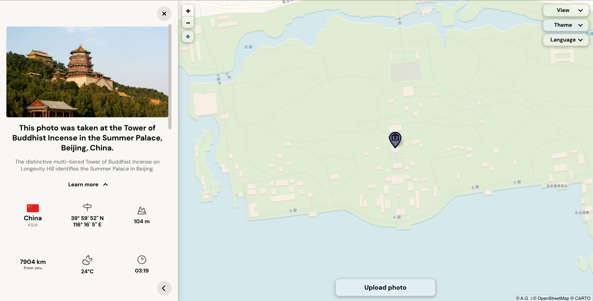

# Geolocator

A photo geolocator built around a multi-source geocoding cascade and cross-language Wikipedia matching. It reads EXIF GPS data when available and falls back to visual recognition when it has to infer the location from the image.

[Live demo](https://antonin-gg.github.io/geolocator/)




## What it does

Geolocator is a small web app that tries to locate a photo on a map.

The result is shown with:

- A map pin
- Optional area outlines for cities, regions, countries, or large landmarks
- A short explanation of how the place was identified
- A geo information panel with country, coordinates, altitude, current weather and local time
- Distance from the user, if location permission is granted, with an animated distance preview on the map 
- A Wikipedia article excerpt about the location, in the user's language

Available in 40+ languages.

## How it works

1. The user uploads a photo. The app first tries to read EXIF GPS metadata. If found, it reverse geocodes the coordinates and uses that as the result.

2. If no GPS data is available, the photo is sent to a Cloudflare Worker that proxies a GPT 5.5 vision request (keeping the API key off the public frontend). The model returns an English place name along with the highest safe specificity level: landmark, city, region, country, or "unknown", and an explanation of the visual evidence used in the user's language.

3. That English place name is fed into a geocoding cascade. Multiple query variations are tried through Nominatim and OpenCage, with strict type filtering first, then loose. The cascade is tuned to fail gracefully: a wrong specific answer is worse than a broader correct one.

4. The identified location triggers a multi-step Wikipedia search flow with a scoring system. Title token matching, coordinate distance, cross-language proper-noun detection, and list/disambiguation filters are all involved. Local language fallbacks run when the English match is uncertain.

5. The result is rendered on the map with a polygon for areas and a pin for landmarks. Optional geo info (such as altitude, weather, time and distance from the user) comes from Open-Meteo, Open Elevation and the browser's geolocation API, and appears in the result panel along with the Wikipedia article excerpt.

## Technical highlights

- **Multi-source, multi-query geocoding cascade.** A precision-first fallback cascade that combines Nominatim and OpenCage with strict and loose type filtering, language-aware token matching with diacritic normalization, and intelligent fallback query generation. It tries the strictest and most specific query first, then progressively relaxes the query and type filters until a safe result is found. Designed to fail safely toward broader correct answers rather than wrong specific ones.

- **Cross-language Wikipedia matching cascade.** A small entity-resolution system with a finely tuned scoring flow: token matching, accent direction detection, coordinate distance weighting, langlink-based translation, proper name detection across languages and a coordinate geosearch fallback.

Both cascades work as small heuristic algorithms: they generate candidates, test them against several signals, and decide when to trust a result, when to fall back, and when a broader answer is safer than a precise but suspicious one.

- **Mobile interaction layer.** A touch-responsive bottom-sheet panel with four states (closed / strip / panel / ultra), drag-follow gestures with axis lock, and browser history handling so the Android back button closes layers in the order they opened.

- **Cancellation-safe async flows.** Every async branch carries a search ID from the start. If the user uploads a new photo mid-search, the older flow is stopped before it writes back to the UI.

- **40+ language UI with grammar-aware sentence construction.** Place names are woven into sentences naturally in each language, not via string replacement. Country names are localized via `Intl.DisplayNames`.

## Why the cascades matter

If the AI model identifies a photo as "Köln, Germany", a simple geocoding query works fine and returns the city. But if the model returns "Bogotá" and the correct interpretation is "Bogotá, Colombia", a simple query can sometimes return a small village in Mexico also named "Bogotá". The cascade catches that false match first with country-code filtering, then with type and token checks if needed. Without that extra logic, the map pin can land 4,000 km away from where it should be. Administrative level matters too. "Rio de Janeiro" can mean the city or the state, and those are different results. If the model's confidence level is "city", the cascade should reject a state-level result. Type filtering catches that kind of false match: it has the wrong administrative level, so it gets rejected.

The Wikipedia search has its own version of this: if the model returns "Cascavel, Brazil", Portuguese Wikipedia can return "Cascavel" meaning "rattlesnake", because the name match is perfect. To reject that kind of false match, the app checks how the article title behaves across languages. A real place name usually stays recognizable through many translations, while a common noun like an animal name changes completely. If the title does not behave like a stable proper noun across languages, the article is rejected.

## Built with

- **Vanilla JavaScript**
- **Leaflet** for the interactive map
- **CARTO** (light theme) and **Stadia Maps** (dark theme) for raster map tiles
- **OpenStreetMap** + **Nominatim** for geocoding
- **OpenCage** as a geocoding fallback (proxied via a Cloudflare Worker)
- **Wikipedia API** for article excerpts
- **Open-Meteo** for weather, altitude, and timezone
- **GPT 5.5 vision model** for visual location recognition (proxied via Cloudflare Worker)
- **exifr** for EXIF metadata parsing

## Architecture

The project is built as a plain frontend app with separate JavaScript files instead of a framework.

The main pieces are:

```txt
dom.js              Cached DOM references
state.js            Shared state and current result object
main.js             Saved preferences and initialization

locator.js          Upload flow with EXIF path and AI path
geocoding.js        Geocoding cascade and result filtering
wiki.js             Wikipedia matching and learn-more content
geoinfo.js          Geo panel with info cards
location.js         User location and distance preview

panel.js            Result panel state machine
ui.js               Dropdowns, theme/view/language controls
touch.js            Mobile/touch gestures
```

The API keys are not stored in the public frontend. Requests that need private keys go through Cloudflare Workers.

```txt
Browser
  → Cloudflare Worker
      → OpenAI / OpenCage
  → Public APIs directly when no private key is needed
      → Nominatim
      → Wikipedia
      → Open-Meteo
      → Open Elevation
```

The simplified flow looks like this:

```txt
User uploads photo
       │
       ▼
  EXIF GPS? ──── yes ──► Reverse geocode ──► Show result
       │
       no
       │
       ▼
  Visual identification (place + confidence + sentence)
       │
       ▼
  Geocoding cascade (Nominatim → OpenCage, strict → loose)
       │
       ▼
  Wikipedia matching (scoring system + tuned filtering)
       │
       ▼
  Map render + geo info panel
```

## Running locally

1. Clone the repo
2. Open index.html in a browser, or run any static server:
`python3 -m http.server` or `npx serve`
3. AI and OpenCage requests go through Cloudflare Workers to hide API keys. For local development against the live demo's workers, no setup is needed. To deploy your own copy, set up your own workers and update the URLs in config.js.
4. All other APIs (Nominatim, Wikipedia, Open-Meteo) work without keys

## What I learned

This project started as a little "locate a photo on a map" experiment, but it ended up becoming a much deeper excercise in frontend architecture, problem-solving, geospatial UX and async safety. 

The project taught me how much engineering can hide behind a seemingly simple feature. The AI integration was the easy part. The geocoding cascade and Wikipedia matching cascade were much harder, because they required actual algorithmic thinking: fallback order, scoring, confidence levels, ambiguity handling, and deciding when a broader answer is safer than a specific but possibly wrong one. But that was also the interesting part, it made the project feel much more like problem solving than just connecting APIs together.

I also learned that mobile browser behavior is complex and full of small details, like file pickers stripping EXIF GPS data or touch gestures fighting scrolling.

## Credits

Spinning globe icon adapted from Phoenix Fox:
https://codepen.io/bluebie/pen/JjdoaLG  
Licensed under the MIT License.